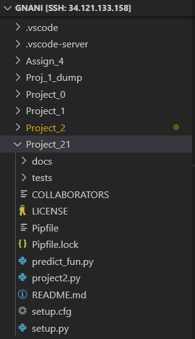
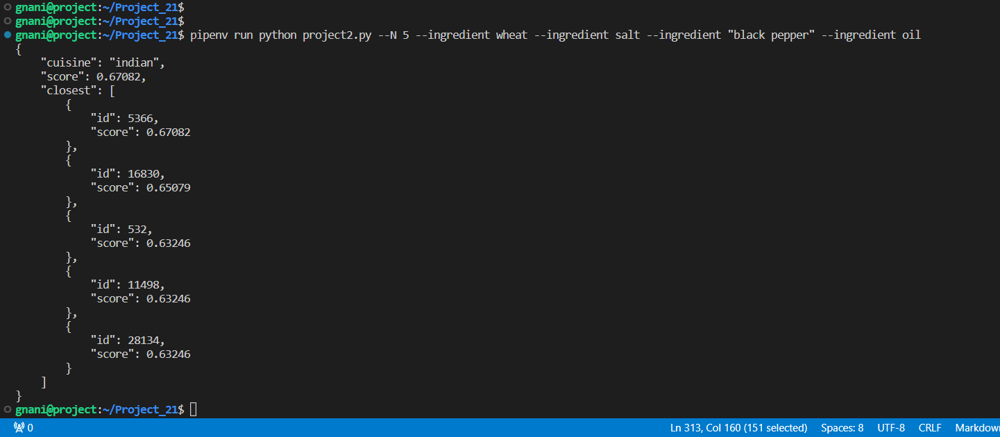
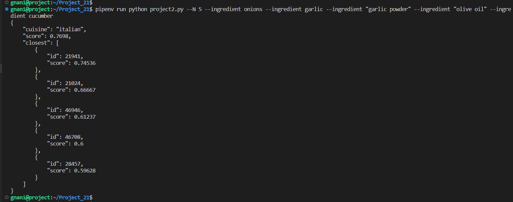
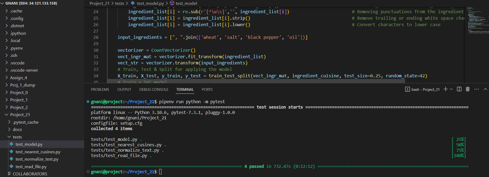

In this project, we perform the prediction of cuisine based on the ingredients taken as input to the program. Moreover, the closest cuisine type, followed by a distance to this cuisine are figured out using the similarity score.

#### Steps followed:

1. Validate if there exists required filters in the argument list. As --N & --ingredient are mandatory, we proceed only if these parameters are passed as input through command line arguments.
2. Capture the N & ingredients values (list of ingredients passed as input).
3. Join the list items (Input ingredients) to form a string and consider it as a list.
4. Read json file and capture the fields and their values from the file and generate corresponding lists.
5. Normalize the text in the file using various pre processing techniques which makes the text to be more suitable for applying models and generate precise results.
6. Use vectorizer to convert the words to feature matrix, transform the input string to matrix.
7. Split the entire collection of ingredients strings and cusine names into train dataset and test dataset.
8. Consider a suitable model, fit it with the input data and predict the model using transformed matrix of input string of ingredients. Capture accurancy score using metrics to understand the effectiveness of model with the data provided.
9. We considered cosine similarity to find the closeness of the predicted result with the desired outcome. We compared the transformed input string with the json file string formed by concatenating the ingredients of each cuisine.
10. We return the cuisine with maximum score and corresponding similarity score. Moreover, we also described the immediate top cuisines which match with the predicted cuisine using their similarity score.

##### Modules and Installation

1. argparse - It helped in handling the aruments passed to the redaction program. It is used to validate the filters and their parameters, parsing the sys.argv list.

It's a python standard library.

```
        import argparse

```

2. CountVectorizer -  It is a tool available in scikit-learn library which helps to transform a given text into a vector based on the frequency (count) of each word that occurs in the entire text.

To Use :

```
        from sklearn.feature_extraction.text import CountVectorizer
```

3. json - It helps us in working with .json files - Reading, Writing and performing operations on file data.

It's a python standard library.

```
        import json

```
4. re - It helps us in working with regular expressions. It provides various functions to work with regular expressions such as matching, searching, and replacing. We used it to match Date, phone number formats.

It's a python standard library.

```
        import re

```

5. os - It helps us in dealing with operating system dependent functionality like reading or writing to the file system, creating new directories, finding current path, validating if a file or directory exists in the file system etc.

It's a python standard library.

```
        import os

```
6. train_test_split - It is a function in Sklearn library which is a part of model selection for splitting data arrays into two subsets: training data and testing data.
To Use :

```
        from sklearn.model_selection import train_test_split
```
7. SVC - It is a supervised machine learning algorithm used for classification tasks. The algorithm works by finding the hyperplane that best separates the different classes in the input data. A linear kernel can be used as normal dot product any two given observations. The product between two vectors is the sum of the multiplication of each pair of input values.
To Use :

```
        from sklearn.svm import SVC
```
8. accuracy_score - It is a function from the sklearn.metrics module in the scikit-learn library, which helps us in  calculating the accuracy of a classification model.
To Use:

```
        from sklearn.metrics import accuracy_score
```
9. cosine_similarity - It is a function from the sklearn.metrics.pairwise module in the scikit-learn library, which is used to calculate the cosine similarity between two vectors. It measures similarity between two non-zero vectors.
To Use:

```
        from sklearn.metrics.pairwise import cosine_similarity
```
10. sys - It helps us in working with some variables and functions used or maintained by the interpreter. Mainly we used it to consider sys.argv and their processing. Moreover, it helped in processing Standard input, output and error streams.

It's a python standard library.

```
        import sys

```


##### File Structure Snap



#### Function - "read_file(inp)"

Input Parameters: 

inp -> file name with absolute path 

Return Values:

ingredient_list -> Strings formed by joining the ingredients of each cuisine (List)
ingredient_cuisine -> Cuisine names from json file (List)

Using the file path, json file has been read and the content can be accessed using load() function and stored to a variable.

```
        with open(inp, "r") as f:
                data = json.load(f)

```

Consider list variables to store the values of cuisine ids, cuisine names and ingredients. To perform the analysis, we consider the ingredients to be a list strings for each cuisine. Moreover, we capture cuisine names as a list.

```
        for recipe in data:
                ingredient_id.append(recipe["id"])                                      # capture Ids of cuisines
                ingredient_cuisine.append(recipe["cuisine"])                            # capture cuisine names
                ingredient_list.append(", ".join(recipe["ingredients"]))       # capture ingredients and convert to a string per cuisine
    
        return ingredient_list, ingredient_cuisine

```

#### Function - "normalize_text(content)"

Input Parameters: 

content -> List of strings formed by joining the ingredients of each cuisine from file (List) 

Return Values:

content -> Normalized text of List of strings (List)

This function helps us in preprocessing the text in the collected list of ingredient strings. It is the process of converting text into a standard form, which helps to reduce noise, ambiguity, in natural language processing (NLP) tasks. Text normalization involves several sub-tasks such as tokenization, Removal of numerals, whitespaces, punctuations and lowercasing etc.

```
        for i in range(len(content)):
        content[i] = re.sub(r'\d+','', content[i])                            # Removing numbers from the content
        content[i] = re.sub(r'[^\w\s]','', content[i])                        # Removing punctuations from the content like (- , / ? ...)
        content[i] = content[i].strip()                                       # Remove trailing or ending white space characters
        content[i] = content[i].lower()                                       # Convert characters to lower case
    
    return content

```
We used 're' module to replace the numbers with empty strings to remove them. Then, punctuations have been removed using re module. Moreover, strip() has been used to eliminate the trailing white space characters. Finally, we converted the text to lower case so that all characters can be analysed in the same case without ambiguity.


#### Function - "model(normalized_content, cusines, input_string)"

Input Parameters: 

normalized_content -> Preprocessed list of strings formed by joining ingredients of each cuisine (List)
cusines -> List of Cuisine names from json file (List)
input_string -> String formed by combining the input ingredients passed through command line as a list item (List)

Return Values:

res[0] -> Predicted Cuisine name
max(collect) -> Cosine Similarity score for the cuisine predicted
score -> Accuracy score of the model
closer -> List of (Id, Cosine Similarity) ; score between transformed matrix of input_ingredient string and ingredient's string of each cuisine. 

Here, CountVectorizer creates a matrix in which each unique word is represented by a column of the matrix, and each text sample from the document is a row in the matrix. Initially, the transformation of text to numbers takes place here. Moreover, the input string is also transformed so that it can be used to predict the outcomes from model.


```
        vectorizer = CountVectorizer()
        vect_ingr_mat = vectorizer.fit_transform(normalized_content)
        vect_str = vectorizer.transform(input_string)

```

Next, we use train_test_split function which splits the entire input dataset into two parts and helps to train the model with one of them and helps to test with other part. Based on the parameters (test_size, train_size), the dataset will get divided. The random_state helps as seed and controls the shuffling of data.


```
        X_train, X_test, y_train, y_test = train_test_split(vect_ingr_mat, cusines, test_size=0.25, random_state=42)

```

Then, various models (K means, RandomForestClassifier, SVC) have been implemented and tested for the accuracy scores upon implementing with the given dataset. By checking the accuracy scores of all models, SVC with linear kernel returned more accuracy  (around 0.7734) with the test_sizeof 0.25 and random_state (42). So, this has been considered for implementation.

 Now, SVC model has been initialized with kernel parametervas 'linear' which helps when there exists a lot of features, in Text Classification. The model has been fit using the train data defined through train_test_split(). Here, predict() has been performed on the model using the transformed input string which returns the predicted cuisine name from the dataset.

```
        model = SVC(kernel='linear')
        model.fit(X_train, y_train)
        res = model.predict(vect_str)
        score = accuracy_score(y_test, model.predict(X_test))

```
To calculate the similarity score, cosine_similarity has been considered which calculates the dot product of two vectors passed to it (i.e., transformed input ingredient's string and ingredients of each cuisine in the file). The maximum score is returned by the function which is considered as the similarity score for the predicted cuisine. Moreover, we consider the list of tuples with values of cuisine ids and their corresponding cosine similarity scores to predict the top n closest cuisines.

```
        for i in data:
                collect.append(cosine_similarity(vect_str, vectorizer.transform([", ".join(i["ingredients"])]))[0][0])
                closer.append((i["id"], cosine_similarity(vect_str, vectorizer.transform([", ".join(i["ingredients"])]))[0][0]))
    
        return res[0], max(collect), score, closer

```


#### Function - "nearest_cusines(closer, n)"

Input Parameters: 

closer -> Input file 
n -> Input parameter (n) - number of required closest cuisines

Return Values:

sorted_list[1 : (int(n)+1)] -> List of (Id, Cosine Similarity) sorted based on the descending order of the cosine similarity to find the top  n matches.


Here, we sort the list of tuples based on the values of cosine similarities in descending order. Now, we can easily capture the required number of closest cuisines which has high score values.

```
        sorted_list = sorted(closer, key=lambda x: x[1], reverse= True)

        return sorted_list[1 : (int(n)+1)]
```

As we need to print the result in the json format, consider creating an empty dictionary and assign the values the of each items of result in the same order. Here, the list of tuples is converted to a list of dictionaries so that it can be represented in json format. The function, dumps() helps in converting python dictionary into json objects.

```
        json_format = {}

        json_format["cuisine"] = cusine_name
        json_format["score"] = round(cusine_score, 5)
        json_format["closest"] = [{"id" : i[0], "score" : round(i[1], 5)} for i in result]

        print(json.dumps(json_format, indent=4))
```


Test Case Checks:
---------------

#### Function - test_read_file()

This function helps in validating the functionality of reading the input json file and check if it retruns the valid outcomes - A list of strings formed by joining the ingredients of each cuisine in the file and A list of cuisine names from the file. The assert statement validates if both of them are lists and check if their length > 0.

```
        a, b = ingredient_list, ingredient_cuisine

        assert type(a)==list and len(a)>0 and type(b)==list and len(b)>0
```
#### Function - test_normalize_text()

This function helps in validating the functionality of the text preprocessing. Here, the assert statement check if the returned object is a python list and also validates if all the strings in the ingredient_list are converted to lower case by comparing the results using islower().

```
        for i in range(len(ingredient_list)):
        ingredient_list[i] = re.sub(r'\d+','', ingredient_list[i])                            # Removing numbers from the ingredient_list
        ingredient_list[i] = re.sub(r'[^\w\s]','', ingredient_list[i])                        # Removing punctuations from the ingredient_list like (- , / ? ...)
        ingredient_list[i] = ingredient_list[i].strip()                                       # Remove trailing or ending white space characters
        ingredient_list[i] = ingredient_list[i].lower()                                       # Convert characters to lower case

        a = ingredient_list

        assert type(a)==list and sum([True for i in a if i.islower()])==len(a)
```

#### Function - test_model()

This function helps in validating the implementation of model on data from json file. Here, the feature matrices are generated from the lists of ingredients, cuisines which have been split for train and test. Then, we fit the model with train data and predicted the cuisine name for the given list of input ingredients. Finally, we calculated cosine similarity to find the closeness of cuisines to the predicted result. Also, we considered a list to capture the nearest cuisines with scores in descending order. Assert statement validates if the cuisine predicted is in list of cuisines from the json file and checks if accuracy score is a float type object and validates if the list retured which helps in predicting closest cuisines.

```
        for i in data:
                collect.append(cosine_similarity(vect_str, vectorizer.transform([", ".join(i["ingredients"])]))[0][0])
                closer.append((i["id"], cosine_similarity(vect_str, vectorizer.transform([", ".join(i["ingredients"])]))[0][0]))

        assert (res[0] in ingredient_cuisine) and type(score)==float and type(closer)==list and len(closer) > 0
```

#### Function - test_nearest_cusines()

This function helps in validating the functionality of closest cuisines. Here, the list of tuples is sorted based on the cosine similarity scores in descending order. Based on n value, we return the top 'n' cuisines with highest similarity score from the total list of findings. Using assert statement, we check if the retruned outcome is a list with length > 0.

```
        sorted_list = sorted(closer, key=lambda x: x[1], reverse= True)

        a = sorted_list[1 : (int(n)+1)]

        assert len(a) > 0 and type(a)==list
```


### Execution:

Import, install all the required modules and packages

We provide the arguments (N & ingredients) as input through command prompt. If a parameter isn't available for the --N  or --ingredient flags, error message is returned.

We run the application using the below command:

Command - 

```
        pipenv run python project2.py --N 5 --ingredient wheat --ingredient salt --ingredient "black pepper" --ingredient oil

```




```

        pipenv run python project2.py --N 5 --ingredient onions --ingredient garlic --ingredient "garlic powder" --ingredient "olive oil" --ingredient cucumber
```



Output - The json formatted string which has the details of predicted cuisine name with it's similarity score and the dictionary of cuisine id and it's corresponding cosine similarity score.


##### Assumptions:

1. SVC - linear kernel has been considered. For the above dataset and train_size, accuracy_score is around (0.7734). The accuracy may vary with the model and random_state and test_size parameters.

2. As the given data is related to ingredients and their details, I haven't considered removal of stop words and performing lemmatization as part of text normalization. This may be required while working with other datasets.

3. The ingredients from input and json file are joined using ', ' so that we can make accurate analysis when there are ingredients with multiple words.

4. CountVectorizer has been used to cconvert the text to numbers and geneate the feature matrices.

5. train_test_split() has been used with test_size = 0.25 and random_state=42.

6. Input ingredients string has been transformed and used to predict the outcome from the model.

7. To find the similarity score, cosine similarity has been considered. This has been calculated between the input ingredient string and string of ingredients from each cuisine of the dataset file. The maximum score has been specified with the predicted cuisine name.

8. To calculate the top n closest cuisines, cosine similarity scores have been considered which are sorted in descending order of their scores and captured corresponding cuisine ids.

9. Scores are rounded to 5 decimal points. So, there may be variation in score representation if the adjacent scores have minimal difference in other decimal places.

10. dumps() from json has been used to convert the dictionaries to json object. 

11. It takes around 7-10 minutes to implement the model and get the result. Hence, I considered to include the Image snapshots of execution.


#### Test Case Run:

```
import pytest
pipenv run python -m pytest

```

Output - It returns the status of test checks based on assert conditions mentioned in the test_*.py files

Execution Sample Gif:

